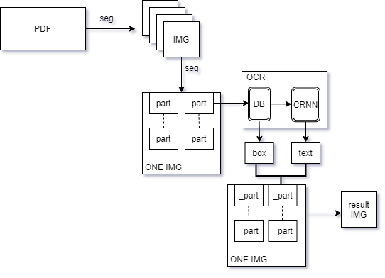
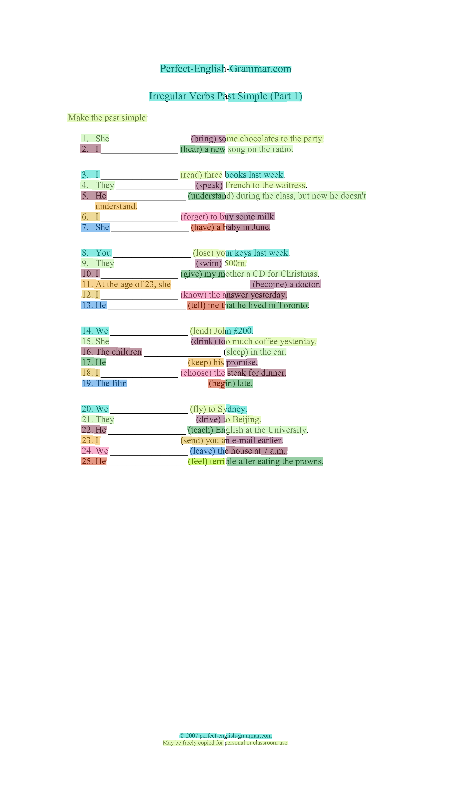
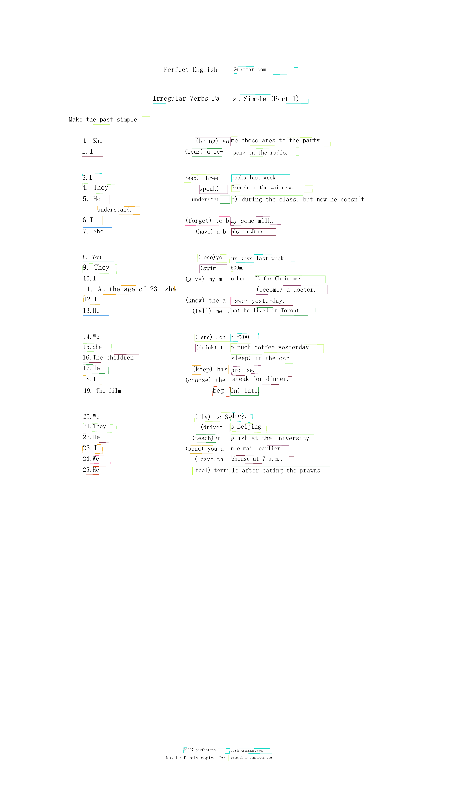

* [ocr](#ocr)
    * [project setup](#project-setup)
    * [process](#process)
    * [output](#output)
    * [loading ...](#loading-)
# ocr

 Lib      | detection model     | Recognition model     
 -------- | :-----------:  | :-----------: 
 paddle     | DB    | CRNN

## project setup
    pip install -r requirements.txt

## process

## output 

## code
[code](struct.md)
## loading ...     